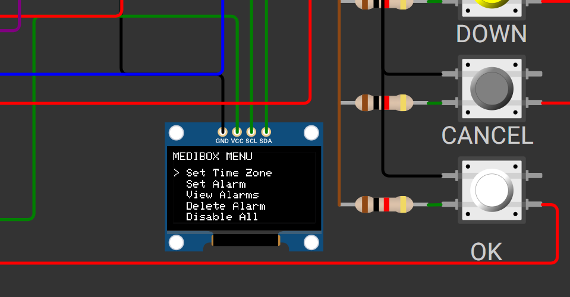
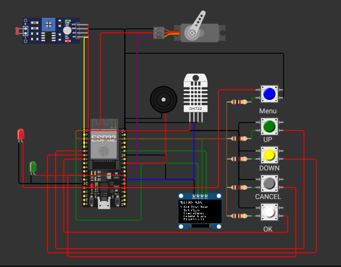

# Smart MediBox - Medication Reminder and Environmental Monitor

This repository contains the firmware and circuit design for the **Smart MediBox** — an ESP32-based smart medicine reminder system with environmental monitoring and user interaction via OLED display and buttons. It is designed as a microcontroller programming assignment using Wokwi simulation and real hardware.

---

## Table of Contents

- [Project Overview](#project-overview)
- [Features](#features)
- [Circuit Design](#circuit-design)
- [Firmware Description](#firmware-description)
- [Menu System](#menu-system)
- [Dependencies & Libraries](#dependencies--libraries)
- [Setup & Usage](#setup--usage)
- [How It Works](#how-it-works)
- [Screenshots & Simulation](#screenshots--simulation)
- [Future Improvements](#future-improvements)
- [Acknowledgements](#acknowledgements)

---

## Project Overview

The Smart MediBox is a compact, automated medicine reminder device built around the ESP32 microcontroller. It provides:

- Accurate time fetching from an NTP server (with timezone offset)
- The ability to set, view, and delete multiple alarms
- Audible and visual alarm reminders
- Snooze functionality for alarms
- Real-time monitoring of temperature, humidity, and ambient light (via DHT22 and LDR sensors)
- Automated environmental warnings when temperature or humidity go beyond healthy thresholds
- A clear, user-friendly OLED interface controlled via push buttons

This device aims to help users maintain strict medication schedules while ensuring safe medicine storage conditions.

---

## Features

- **Accurate Time Sync:** Retrieves network time from `pool.ntp.org` with configured timezone offset
- **Dual Alarm System:** Supports setting two alarms with enable/disable and delete functionalities
- **Visual & Sound Alerts:** Uses OLED screen, LEDs, and buzzer for notifications
- **Snooze & Stop Functions:** Easy control to delay or stop alarms via dedicated buttons
- **Environmental Sensing:** Monitors temperature, humidity, and light intensity
- **Automated Warnings:** Alerts user visually and audibly if environmental conditions exceed preset healthy limits
- **Intuitive Menu Navigation:** Menu driven by four push buttons (UP, DOWN, OK, CANCEL)
- **Servo Motor Control:** Controls a servo to adjust a shaded window based on sensor inputs using a defined algorithm

---

## Circuit Design

The project is based on the following key hardware components, all integrated on a simulated Wokwi ESP32 development board setup:

- **ESP32 DevKit C**
- **OLED Display (SSD1306 128x64)**
- **4 Push Buttons** for Menu, Up, Down, Cancel, OK
- **DHT22 Sensor** for temperature and humidity
- **Photoresistor (LDR)** for light intensity
- **Servo motor** for shaded window adjustment
- **Buzzer** for audible alerts
- **LEDs** indicating status and warnings

The Wokwi circuit JSON is embedded in the project for simulation and can be found in `/circuit` or directly simulated online.

---

## Firmware Description

The firmware is written in C++ targeting the ESP32 platform, utilizing the Arduino framework. Key functional modules include:

- **WiFi Connection & NTP Time Sync:** Connects to WiFi and retrieves accurate time with timezone offset handling.
- **MQTT Client:** Publishes sensor data and subscribes to configuration topics using HiveMQ public broker.
- **Sensor Reading:** Periodically samples LDR (light), DHT22 (temperature & humidity), and averages light over configurable intervals.
- **Servo Angle Calculation:** Implements a mathematical model to control servo angle based on sensor readings and user-configured parameters.
- **Display Management:** OLED display depicts the current time, date, temperature, humidity, and menu interface.
- **Alarm Management:** Set, view, delete, and disable alarms with audible and visual notifications.
- **Menu System:** Responsive to multiple pushbuttons with debouncing, enabling user-friendly navigation.

---

## Menu System

The menu provides following options controlled via buttons:

| Option           | Description                          |
|------------------|------------------------------------|
| Set Time Zone    | Configure timezone offset (Placeholder, not fully implemented) |
| Set Alarm        | Set a new alarm time (hours and minutes) |
| View Alarms      | View all active alarms              |
| Delete Alarm     | Delete a selected alarm             |
| Disable All      | Disable all alarms                  |

The UI cursor highlights the selected menu item and interacts on button presses.

---

## Dependencies & Libraries

- **WiFi.h** – ESP32 WiFi connectivity
- **PubSubClient.h** – MQTT broker client
- **DHT.h** – To interface with DHT22 temperature/humidity sensor
- **ESP32Servo.h** – Control servo motor
- **Wire.h**, **Adafruit_GFX.h**, **Adafruit_SSD1306.h** – For OLED display control
- **time.h** – To handle NTP time synchronization
- Standard C++ STL (`<vector>`) for dynamic alarm list handling

---

## Setup & Usage

1. Connect the hardware components as per the Wokwi simulation schematic or equivalent physical wiring.
2. Configure your WiFi credentials in the source file (`ssid`, `password`).
3. Upload the firmware to your ESP32 board.
4. Watch the OLED for initial wifi and MQTT connection states.
5. Use the buttons to navigate the menu and set alarms.
6. Monitor temperature, humidity, and light values on the display.
7. When an alarm triggers, buzzer and LEDs will alert you; use buttons to stop or snooze.
8. Environmental warnings activate visual and audio alerts outside preset healthy bounds.

---

## How It Works

- Upon powering on, the ESP32 connects to WiFi and syncs time via NTP.
- Sensor readings are sampled regularly; light readings are averaged over configurable periods.
- The servo angle is dynamically calculated using the sampled data and configuration parameters sent via MQTT.
- Alarms are checked every minute; if alarm time is reached, notifications and sounds activate.
- The menu allows easy interaction to manage settings and alarms in real-time.

---

## Screenshots & Simulation

  
*Sample OLED menu screen.*

  
*Wokwi simulation with ESP32, sensors, buttons, and OLED.*

> *Note: Replace the above images with your actual screenshots or simulation captures.*

---

## Future Improvements

- Enable full time zone setting functionality.
- Implement persistent storage of alarms in non-volatile memory.
- Add snooze duration configuration.
- Integrate advanced power-saving modes.
- Expand sensor types and environmental controls.
- Expand MQTT topics and cloud integration for remote monitoring.

---

## Acknowledgements

This project is based on the EN2853: Embedded Systems and Applications course.  
Developed by Lithira Budvin using Wokwi simulation and ESP32 platform.

---

---

**Thank you for exploring the Smart MediBox project!**

